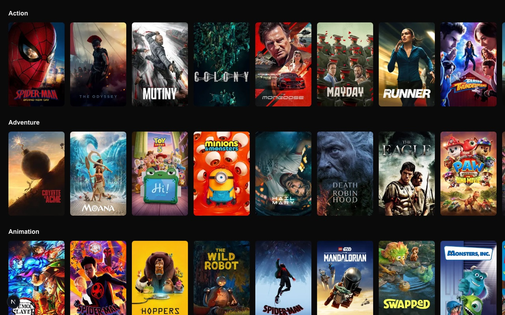

# webshow-web

Netflix-style catalogue frontend for the webshow portfolio. Built with the Next.js App Router:
server components fetch the [webshow-core](../webshow-core) API and render genre rows of poster
tiles, a hover preview card, and a movie detail modal with an ambient trailer.



## Run locally

Needs webshow-core running on `http://localhost:3001`.

```bash
cp .env.example .env.local   # sets API_BASE_URL
npm install
npm run dev                  # http://localhost:3000
```

## Scripts

| Script                 | What it does                          |
| ---------------------- | ------------------------------------- |
| `npm run dev`          | Start the dev server on :3000         |
| `npm run build`        | Production build (also type-checks)   |
| `npm run start`        | Serve the production build            |
| `npm run lint`         | ESLint                                |
| `npm run format`       | Prettier, write changes               |
| `npm run format:check` | Prettier, fail if anything would move |
